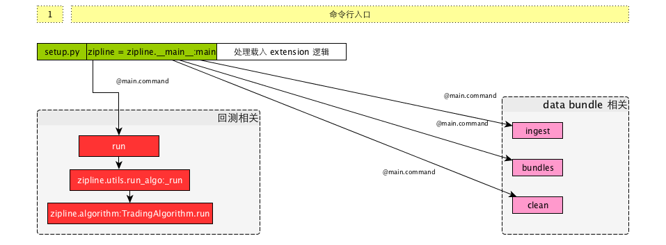

# zipline的命令行入口

## 先上个图




## 几种使用方式

首先`zipline`主要有三种启动的方式：

1. 使用`zipline`命令行工具
2. 使用`jupyter notebook` 的`zipline`集成`magic`
3. 直接自己组装和调用`TradingAlgorithm`

我们主要以`zipline`命令行工具为研究对象，来看一下它的结构，其它情况类似

## zipline 命令行

首先从`setup.py`中可以看到代码的entry_point

```python
entry_points={
    'console_scripts': [
        'zipline = zipline.__main__:main',
    ],
    ....
}
```

研究 `__main__.py` 文件，发现其石宏了 `click` （http://click.pocoo.org/）包来做命令行接口的路由，其中可以分为4个子命令

* run : 负责执行策略
* ingest : 负责拉取策略所需的数据包(bundle)
* bundles : 查看所有数据包
* clean: 清除数据包

后两个命令都比较简单，前两个里面的逻辑相对复杂一些。

其中 在`main`的入口中，除了者几个子命令，它还是用了`load_extensions`来载入所有的扩展，`-extension` 可以指定扩展的列表。

`run`命令在一些初始化和装载过程之后，会调用TradingAlgorithm的run方法。

`ingest`命令会调用`data.bundles.core`的`ingest`函数来进行拉取。

