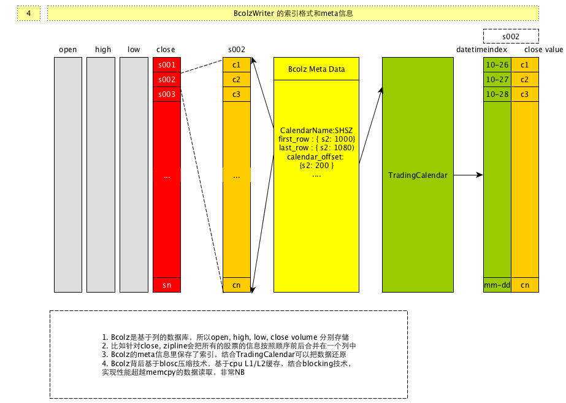

# 国内股票行情信息

## Databundle


zipline 缺省提供了一些行情的data bundle ， 可以通过 `zipline bundles` 查看

其中 `quandl` 数据源是从 https://www.quandl.com/ 网站的WIKI dataset获取数据的，不过通过该api数据较慢，因为逐批获取之后还要处理后才放到本地。`quantopian-quandl `一份备份数据，相当于将处理后的数据打包之后提供，下载下来解压到 `~/.zipline/data`目录，所以相对较快，如果有研究美国股市的量化交易，可以使用这些数据源，还有yahoo数据源，它的好处是可以自己定制要抓取的数据集，如果你只需要配置好然后通过 `ipline.data.bundles.register` 进行注册即可。

如果列位想引入国内的数据源进行回测，那么恐怕要下点功夫啦，下面可以给出如下几种方案：

* 不ingest数据源，直接在构建`TradingAlgorithm`的时候引入如从`csv`或者`数据库`里读取出来的`pd.Dataframe`信息作为`DataPortal`的`datasource`（当然最终会转化为`pd.Panel`)
* 自己定制`data bundle` ，然后`ingest`

如果你要测试的数据集比较小，股票数量也比较少，那么第一种方案是比较方便的，如果需要大量的数据，还是自己写data bundle 比较方便（并且貌似使用Dataframe也很难处理有 split或者dividend的股票）

那么如何编写一个新的bundle的扩展呢？

其实比较简单，自己实现一个`ingest`函数即可

该`ingest`函数的参数如下：

```python
ingest(environ,
       asset_db_writer,
       minute_bar_writer,
       daily_bar_writer,
       adjustment_writer,
       calendar,
       start_session,
       end_session,
       cache,
       show_progress,
       output_dir)
```

其中这个函数是被`environ`回调的，所以参数列表无法自己指定，下面简单介绍一下几个参数的作用

| 参数                        | 作用                                       |
| ------------------------- | ---------------------------------------- |
| environ                   | 代表环境变量的一映射，如果你需要一些额外的参数引入，可以在这里通过环境变量指定，如`quandl`的API key |
| asset_db_writer           | [`AssetDBWriter`](http://www.zipline.io/appendix.html#zipline.assets.AssetDBWriter)的实例，通过它的write函数可以把一个证券（如股票）的基础信息，主要是码表，名称，起止日期等信息写入到数据库中，并且为每个证券分配一个sid作为唯一标识，这个sid在系统的其它地方也会成为股票的主要索引方式。默认保存在sqlite数据库中 |
| daily_bar_writer          | 写入每日的行情信息   [`BcolzDailyBarWriter`](http://www.zipline.io/appendix.html#zipline.data.us_equity_pricing.BcolzDailyBarWriter)的实例，通过调用write方法写入股票的开高低收和成交量等信息（OHLCV），这里的信息也需要使用sid与基本信息进行关联。默认使用bcolz的格式保存 |
| minute_bar_writer         | 写入每分钟行情的...                              |
| adjustment_writer         | 处理一些拆分，合并，送股，分红等事件的信息。默认使用sqlite数据库保存    |
| calendar                  | 你当前使用的`交易日历`，数据的获取是以交易日历作为索引的，也就是说，如果你的交易日历里那一天存在，可是你无法读取行情数据，很有可能会出现错误，所以`calendar`和你的`行情信息`的匹配是很关键的 |
| start_session/end_session | 获取数据的起止日期                                |
| cache                     | [`dataframe_cache`](http://www.zipline.io/appendix.html#zipline.utils.cache.dataframe_cache)的实例，你可以使用它来缓存在获取过程中的原始信息，在多次ingest的时候起到加速的作用 |
| show_progress             | 一个布尔值，是否显示ingest的过程，如果你的获取数据时间较长，可以判断show_progress变量来显示进度。 |
| output_dir                | data bundle的输出目录，如果你的data bundle 是类似 `quantopian-quandl`这种通过下载远程已经写好的数据源，并且解压到本地的，可以直接使用这个变量获取最终解压目录 |

一般来说，获取一个行情的数据源，主要需要三方面的信息

1. 使用 `asset_db_writer` 获取基础信息
2. 使用 `daily_bar_writer`/`minute_bar_writer` 写入行情信息
3. 使用 `adjustment_writer`写入split, dividend信息。

话说这里坑不少，我建议多看看官方的例子，大部分都要讲数据处理为pd.Dataframe的结构再进行的。另外我自己也写了一些简单的demo，可以参考:

https://github.com/rainx/zipline_cn_databundle

里面代码比较凌乱，有很多无用代码，主要参考一下`squant_source`模块

https://github.com/rainx/zipline_cn_databundle/blob/master/zipline_cn_databundle/squant_source.py

不过代码里用到了我自己写的一个squant包，是一个私有数据包，因为应用了很多内部数据，不便公开，所以大家恐怕无法直接使用。主要是asset和adjuestment的部分，对于行情，我使用的是通达信的客户端的本地数据(木有windows , 从别的机器拷贝的 T_T)，大家应该可以直接使用，参考里面的`TdxReader` (https://github.com/rainx/zipline_cn_databundle/blob/master/zipline_cn_databundle/tdx/reader.py)


## Bcolz

zipline的本地行情是写入到`bcolz`的格式的，它是底层使用`Blosc`库的基于列的数据库，至于为什么使用基于列的数据库，应该是与行情信息的特质有关，因为行情信息可以通过TradingCalendar和Bcolz的元信息进行索引，并且以时间顺序排列，而且是相同的类型，所以非常适合类似数组结构的存储方式，加之以Blosc的变态级别的压缩解压算法（使用CPU L1/L2缓存进行压缩/解压，平均速度超过了`memcpy`调用），所以对时间和空间上都可以做到比较优化的状态。

内部的索引结构大概抽象为：

