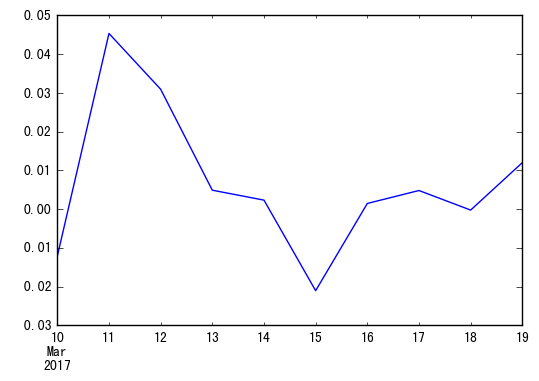
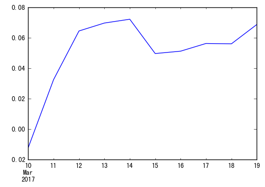

# 风险指标的计算 (empyrical模块)

## 概述

量化中，我们经常会遇到各种量化指标的计算，对于zipline来说，也会对这部分计算进行处理，由于指标计算的通用性比较强，所以，zipline单独封装了 ```empyrical``` 这个模块，可以处理类似的计算，由于这个模块并不依赖其它zipline模块，我们可以在我么的项目中单独使用它。

## 安装

```python
pip install empyrical
```

它会依赖安装 numpy, scipy, pandas 等模块

## 使用

### 导入


```python
from empyrical import (
    alpha,
    beta,
    alpha_beta_aligned,
    annual_volatility,
    cum_returns,
    annual_return,
    downside_risk,
    information_ratio,
    max_drawdown,
    sharpe_ratio,
    sortino_ratio,
    calmar_ratio,
    omega_ratio,
    tail_ratio
)
```

### 初始数据

#### 策略收益率

大多数函数的参数都需要策略的收益率列表，格式为 pandas.Series 结构，如下：

```
...
2015-07-16    -0.012143
2015-07-17    0.045350
2015-07-20    0.030957
2015-07-21    0.004902
...
```

索引为一个时间序列， 值为每日的收益率，为一个百分比，并且是非累积的，也就是每天相对于上一个交易日的收益比率。

下面我们构造一个初始数据


```python
import pandas as pd
returns = pd.Series(
    index=pd.date_range('2017-03-10', '2017-03-19'), 
    data=(-0.012143, 0.045350, 0.030957, 0.004902, 0.002341, -0.02103, 0.00148, 0.004820, -0.00023, 0.01201)
)
```


```python
returns
```


    2017-03-10   -0.012143
    2017-03-11    0.045350
    2017-03-12    0.030957
    2017-03-13    0.004902
    2017-03-14    0.002341
    2017-03-15   -0.021030
    2017-03-16    0.001480
    2017-03-17    0.004820
    2017-03-18   -0.000230
    2017-03-19    0.012010
    Freq: D, dtype: float64


```python
returns.plot()
```


    <matplotlib.axes._subplots.AxesSubplot at 0x7f3bd6fecda0>





#### 基准收益率

和策略收益一样，我们可以构造一个模拟的基准收益


```python
benchmark_returns = pd.Series(
    index=pd.date_range('2017-03-10', '2017-03-19'), 
    data=(-0.031940, 0.025350, -0.020957, -0.000902, 0.007341, -0.01103, 0.00248, 0.008820, -0.00123, 0.01091)
)
```

### 计算累计收益


```python
creturns = cum_returns(returns)
```


```python
creturns
```


    2017-03-10   -0.012143
    2017-03-11    0.032656
    2017-03-12    0.064624
    2017-03-13    0.069843
    2017-03-14    0.072348
    2017-03-15    0.049796
    2017-03-16    0.051350
    2017-03-17    0.056417
    2017-03-18    0.056174
    2017-03-19    0.068859
    Freq: D, dtype: float64


```python
creturns.plot()
```


    <matplotlib.axes._subplots.AxesSubplot at 0x7f3bd65eb0b8>





### 计算最大回撤


```python
max_drawdown(returns)
```


    -0.02103000000000009


### 计算年化收益


```python
annual_return(returns)
```


    4.3554273608590925


### 年化Volatility (策略波动率)
用来测量策略的风险性，波动越大代表策略风险越高。 


```python
annual_volatility(returns, period='daily')
```


    0.3055933840036463


### Calmar比率
Calmar比率描述的是收益和最大回撤之间的关系。计算方式为年化收益率与历史最大回撤之间的比率。Calmar比率数值越大，基金的业绩表现越好。反之，基金的业绩表现越差。


```python
calmar_ratio(returns)
```


    207.10543798664165


### Omega比率

介绍： Omega函数是用来分析收益分布的一种方法，它是一种天然的业绩指标。基于Omega的分析是在下跌，下偏矩和损益文献的精神上进行的。Omega函数捕捉到在收益分布上的所有高阶矩信息并且影响收益水平的敏感性。

公式意义：Omega越高越好，它是对偏度和峰值的一个调整。


```python
omega_ratio(returns=returns, risk_free=0.0001)
```


    3.0015132184078577


### Sharpe比率
核心思想：理性的投资者将选择并持有有效的投资组合.

公式意义：夏普指数代表投资人每多承担一分风险，可以拿到几分收益；若为正值，代表基金收益率高过波动风险；若为负值，代表基金操作风险大过于收益率。每个投资组合都可以计算Sharpe ratio，即投资回报与多冒风险的比例，这个比例越高，投资组合越佳。


```python
sharpe_ratio(returns=returns)
```


    5.6451366106126715


### sortino比率

介绍： Sortino ratio是一个能够评价投资资产、组合或者策略收益的指标。它是夏普比率的修正，它只对收益低于某个值的波动性进行衡量，这个值可能是持有者规定的目标收益或者是要求收益，而夏普比率是同时对上涨的和下降的波动进行衡量。尽管这两个比率都衡量的是一个调整后的投资风险，但它们的意义却不同，这导致投资的收益的结果不同。

核心思想： 
公式及其解释:R是资产或组合的预期收益，T是投资策略的目标或要求的收益，起源于最小可接受收益。DR是目标方差的平方根。也就是二阶低偏矩。
Sharpe and Omega-Sharpe ratio的一个自然扩展就是由Sortino在1991年提出的，他使用的是downside risk作为分母，downside risk就是二阶下偏矩。
总风险用下降风险所代替，因为投资组合经理不会被上涨的变化而惩罚，但会被低于最小目标收益的变化而惩罚。
用下降标准差而不是总标准差，以区别不利和有利的波动。


```python
sortino_ratio(returns=returns)
```


    14.150708210667487


### 下降风险


```python
downside_risk(returns=returns)
```


    0.12191025172150209


### 信息比率(Information Ratio)

信息比率主要是用来衡量某一投资组合优于一个特定指数的风险调整超额报酬，或者说是用来衡量超额风险所带来的超额收益。它表示单位主动风险所带来的超额收益。

Information Ratio = α∕ω (α为组合的超额收益，ω为主动风险)

计算信息比率时，可以将基金报酬率减去同类基金或者是大盘报酬率(剩下的值为超额报酬)，再除以该超额报酬的标准差。信息比率越高，该基金表现持续优于大盘的程度越高。


```python
information_ratio(returns=returns, factor_returns=benchmark_returns)
```


    0.43383172638699696


### Alpha

投资中面临着系统性风险（即Beta）和非系统性风险（即Alpha），Alpha是投资者获得与市场波动无关的回报。比如投资者获得了15%的回报，其基准获得了10%的回报，那么Alpha或者价值增值的部分就是5%。


```python
alpha(returns=returns, factor_returns=benchmark_returns, risk_free=0.01)
```


    0.7781943501778946


### Beta

表示投资的系统性风险，反映了策略对大盘变化的敏感性。例如一个策略的Beta为1.5，则大盘涨1%的时候，策略可能涨1.5%，反之亦然；如果一个策略的Beta为-1.5，说明大盘涨1%的时候，策略可能跌1.5%，反之亦然。 


```python
beta(returns=returns, factor_returns=benchmark_returns, risk_free=0.01)
```


    0.56157656832313008


### Tail Ratio


```python
tail_ratio(returns=returns)
```


    2.2825137911495892


## 其他说明

上面很多参数都涉及到年华指标，他们都会涉及到两个可选的参数, ```period```, ```annualization``` , 其中，如果设置了 annualization ，则 period会被忽略， 

他们是用来设置策略的年化频率的，对于period 设置为一个字符串，可以设置的参数为 'monthly', 'weekly' , 'daily'， 后面是默认的值
，
```python
{'monthly':12
 'weekly': 52
 'daily': 252}
```

如果需要覆盖默认的值， 则可以通过 ```annualization``` 参数来设定。
