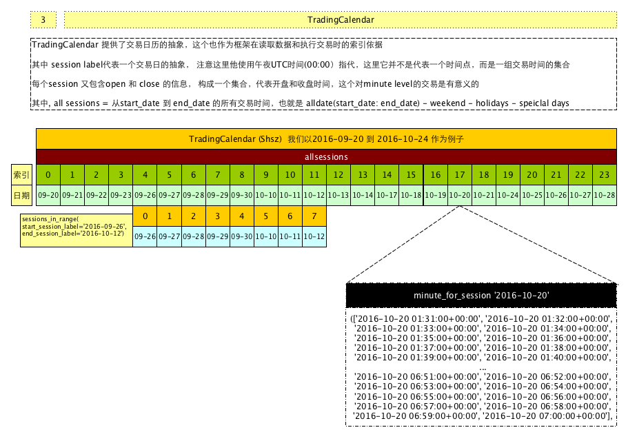

# 了解TradingCalendar

本文大部分内容都是我在研究`TradingCalendar`时所记得笔记，这个图是我后期整理的，




TraderCalendar的解释：

```
一个TraderCalendar代表一个单独交易市场的时间信息，时间信息由两部分组成 sessions 和 opens/closes

session代表一个连续的分钟时间段， 使用UTC的午夜时间来定义， 注意它代表的不是一个时间点，使用UTC午夜时间只是为了方便
```

里面有很多函数是处理minute 和 session转换以及获取开收盘时间时间

对应文档在

[http://www.zipline.io/appendix.html#trading-calendar-api](http://www.zipline.io/appendix.html#trading-calendar-api)

[http://www.zipline.io/_modules/zipline/utils/calendars/trading_calendar.html](http://www.zipline.io/_modules/zipline/utils/calendars/trading_calendar.html)

系统自带的calendars 可以通过``zipline.utils.calendars.get_calendar`获取，如：

```python
from zipline.utils.calendars import get_calendar

c = get_calendar("NASDAQ")
```

获取了纳斯达克的calendar, 注意，这里的calendar是存在别名的，不同的交易所可能对应同样的别名，只要它们的交易时间相同，如 `NASDAQ` 交易所的别名就和`NYSE`相同， 这部分定义可以查看`zipline.utils.calendars.calendar_utils`模块下看到定义


```python
_default_calendar_factories = {
    'NYSE': NYSEExchangeCalendar,
    'CME': CMEExchangeCalendar,
    'ICE': ICEExchangeCalendar,
    'CFE': CFEExchangeCalendar,
    'BMF': BMFExchangeCalendar,
    'LSE': LSEExchangeCalendar,
    'TSX': TSXExchangeCalendar,
    'us_futures': QuantopianUSFuturesCalendar,
}
_default_calendar_aliases = {
    'NASDAQ': 'NYSE',
    'BATS': 'NYSE',
    'CBOT': 'CME',
    'COMEX': 'CME',
    'NYMEX': 'CME',
    'ICEUS': 'ICE',
    'NYFE': 'ICE',
}
```


需要注意的是：这里所有的开收盘时间都被转化为UTC时间，但是在函数里面传入的大多数时间pd.Timestamp，都会去掉时区信息，并设置为utc时间，这里不是用 astimezone转化为utc时间，而是直接变为utc时区的时间，具体的时间不变，如 

```python
Timestamp('2016-09-27 09:30:00+0800', tz='Asia/Shanghai')
会直接变为
Timestamp('2016-09-27 09:30:00+0800', tz=‘UTC')
```

我们举个使用TradingCalendar的例子

我们看一下美国的2016年9月27日开收盘信息

```python
In [115]: c.open_and_close_for_session(pd.Timestamp('2016-09-27 00:00', tz=pytz.UTC))
Out[115]:
(Timestamp('2016-09-27 13:31:00+0000', tz='UTC'),
 Timestamp('2016-09-27 20:00:00+0000', tz='UTC'))
```

这里的 13:31:00 和 20:00:00 都是UTC时间，对应美国的时间为

```python
In [118]: [d.astimezone(pytz.timezone('America/New_York')) for d in c.open_and_close_for_session(pd.Timestamp('2016-09-27 00:00', tz=pytz.UTC))]
Out[118]:
[Timestamp('2016-09-27 09:31:00-0400', tz='America/New_York'),
 Timestamp('2016-09-27 16:00:00-0400', tz='America/New_York')]
```

以此类推，国内的开收盘时间对应的UTC时间应该为：

```python
In [110]: shanghaiopen = pd.Timestamp('2016-09-27 09:30:00', tz=pytz.timezone('Asia/Shanghai'));

In [111]: shanghaiopen.astimezone(tz=pytz.UTC)
Out[111]: Timestamp('2016-09-27 01:30:00+0000', tz='UTC')

In [112]: shanghaiclose = pd.Timestamp('2016-09-27 15:00:00', tz=pytz.timezone('Asia/Shanghai'));

In [113]: shanghaiclose.astimezone(tz=pytz.UTC)
Out[113]: Timestamp('2016-09-27 07:00:00+0000', tz='UTC')
```

谢天谢地，还是在 UTC的同一天的，估计类似欧洲一些国家的股市就悬了

`regular_holidays`对应的 `AbstractHolidayCalendar` 的实现保存着节假日的信息

```python
In [120]: c.regular_holidays
Out[120]: <zipline.utils.calendars.trading_calendar.HolidayCalendar at 0x118c75588>

In [121]: c.regular_holidays.holidays
Out[121]: <bound method HolidayCalendar.holidays of <zipline.utils.calendars.trading_calendar.HolidayCalendar object at 0x118c954e0>>

In [122]: c.regular_holidays.holidays()
```

在美国有一个`special_close`, `special_open`的概念，在国内好像没有，好像是在指定的日期会提早收盘，这个信息通过一个数组保存，里面可能有多个提早收盘的时间点和收盘的列表。

有两种不同的表示， 一种是可以用常规的holiday对象表示，还有一种则直接写明日期

```python
(datetime.time(13, 0),
  <zipline.utils.calendars.trading_calendar.HolidayCalendar at 0x118cecb00>),
 (datetime.time(14, 0),
  <zipline.utils.calendars.trading_calendar.HolidayCalendar at 0x118cec8d0>)]

In [131]: c.special_closes[0][1].holidays()
Out[131]:
DatetimeIndex(['1993-11-26', '1994-11-25', '1995-07-03', '1995-11-24',
               '1996-07-05', '1996-11-29', '1996-12-24', '1997-07-03',
               '1997-11-28', '1997-12-24', '1998-11-27', '1998-12-24',
               '1999-11-26', '2000-07-03', '2000-11-24', '2001-07-03',
               '2001-11-23', '2001-12-24', '2002-07-05', '2002-11-29',
               '2002-12-24', '2003-07-03', '2003-11-28', '2003-12-24',
               '2004-11-26', '2005-11-25', '2006-07-03', '2006-11-24',
               '2007-07-03', '2007-11-23', '2007-12-24', '2008-07-03',
               '2008-11-28', '2008-12-24', '2009-11-27', '2009-12-24',
               '2010-11-26', '2011-11-25', '2012-07-03', '2012-11-23',
               '2012-12-24', '2013-11-29', '2013-12-24', '2014-07-03',
               '2014-11-28', '2014-12-24', '2015-11-27', '2015-12-24',
               '2016-11-25', '2017-07-03', '2017-11-24', '2018-07-03',
               '2018-11-23', '2018-12-24', '2019-07-05', '2019-11-29',
               '2019-12-24', '2020-11-27', '2020-12-24', '2021-11-26',
               '2022-11-25', '2023-07-03', '2023-11-24', '2024-07-05',
               '2024-11-29', '2024-12-24', '2025-07-03', '2025-11-28',
               '2025-12-24', '2026-11-27', '2026-12-24', '2027-11-26',
               '2028-07-03', '2028-11-24', '2029-07-03', '2029-11-23',
               '2029-12-24', '2030-07-05', '2030-11-29', '2030-12-24'],
              dtype='datetime64[ns]', freq=None)

In [133]: c.special_closes_adhoc
Out[133]:
[(datetime.time(13, 0),
  ['1997-12-26', '1999-12-31', '2003-12-26', '2013-07-03'])]
```

如果是自己实现的`TradingCalendar`，可以继承 `TradingCalendar`类，然后通过`register_calendar`方法来注册。

这里有一个我写的例子

https://github.com/rainx/cn_stock_holidays/blob/master/cn_stock_holidays/zipline/exchange_calendar_shsz.py

由于国内股市的节假日时间信息无法通过类似美国的有明确的假期规则，所以这里使用了它的`adhoc_holidays`的方式，也就是类似枚举的方式获得，这里我通过 `cn_stock_holidays` （https://github.com/rainx/cn_stock_holidays） 项目维护了一个节假日列表，历史节假日我是根据历史指数的非周六日的无开盘记录来获取的，未来的可预期的节假日我也会保持更新，如果你在其他项目里用到该数据，可以直接安装使用。

```bash
pip install git+https://github.com/rainx/cn_stock_holidays.git
```

具体的使用说明，可以参考github上的文档

具体的使用方式为

```python
from cn_stock_holidays.zipline.exchange_calendar_shsz import SHSZExchangeCalendar
register_calendar("SHSZ", SHSZExchangeCalendar(), force=True)
c=get_calendar("SHSZ")
```


或者你也可以直接使用我这边已经注册的单例

```python
from cn_stock_holidays.zipline.default_calendar import shsz_calendar
```

直接获取到 shsz_calendar的实例。

除了休市时间外，对于国内股市还有一点区别是日内的午休时间，这个在国外是没有的，这个应该对分钟数据有影响，所以在`SHSZExchangeCalendar`的实现里，我重写了 `all_minutes` 使其支持国内的`lunch break`


